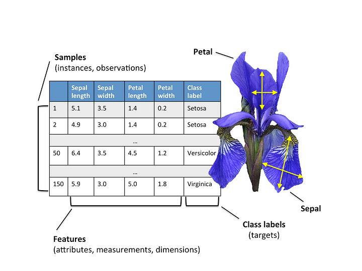

# Identifying Iris with Neural Networks


## Dataset

The dataset at [iris.csv](iris.csv) contains height and width of iris petals and sepals, as shown below.



## Requirements

Install python dependencies with

```
pip install -r requirements.txt
```

## Source code

The source code is at [iris.ipynb](iris.ipynb).
